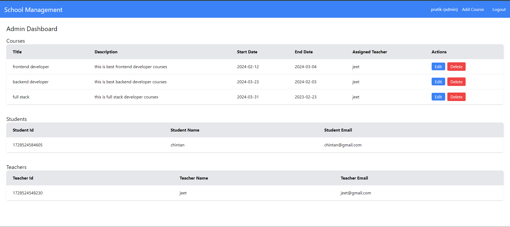
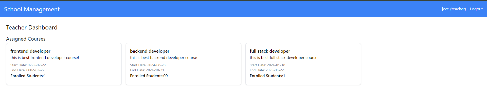

# Education Management (Create React App)

This project is a Student Course Management System built using React. It allows teachers and students to manage courses and enrollments efficiently. The system provides a user-friendly interface for teachers to create courses and manage enrolled students, while students can view their enrolled courses and explore course details.





## Key Features:
- Student Dashboard: Students can view their enrolled courses and access detailed information about each course.
- Course Details: The course details page displays enrolled students and provides additional course information, such as title and description.
- Student Enrollment: Teachers can add students to courses through a dropdown menu. The system prevents duplicate enrollments and validates the selected students.
- Local Storage Management: Both course and student data are stored in the browser’s local storage for development and testing purposes, allowing easy retrieval and updates.
- Responsive Design: The interface is responsive and optimized for different screen sizes, providing a seamless user experience.

## Project Structure:
- Teacher's Course Management: Teachers can add students to their courses and view the list of enrolled students.
- Student's Course Details: Students can view detailed information about their courses and see other students enrolled in the same course.
- Local Storage for Data Persistence: The system uses local storage to persist course and student data for development, which mimics interaction with a real backend.


## Start the React application:

```
npm run start
```